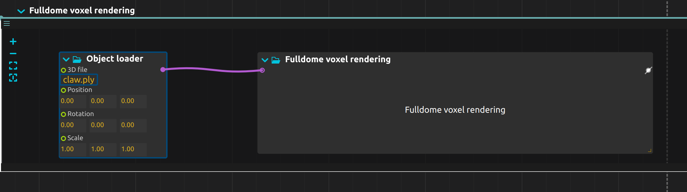
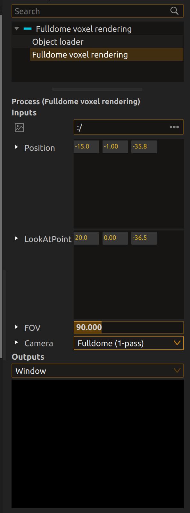

# Fulldome Voxel Raytracing Rendering Plugin

## 1. What is it?

This project is a **plugin for [ossia score](https://ossia.io/score/)** that implements **real-time voxel rendering** using **Vulkan ray tracing**.  
It is designed for **fulldome visualization**, where the field of view (FOV) exceeds **180°**, enabling immersive dome projections.

Key features:
- Built on top of **Vulkan Ray Tracing (VK_KHR_ray_tracing_pipeline, VK_KHR_acceleration_structure, etc.)**
- Implements a **voxel rendering pipeline** via ray tracing shaders (`raygen`, `closesthit`, `miss`)
- Supports **fulldome projection mode**, sending rays across fulldome view
- Integrated seamlessly as a plugin inside **ossia score’s system**

---

## 2. How to Use It

### Prerequisites
- [ossia score](https://github.com/ossia/score) built with **Qt 6.9+** and **Vulkan** enabled
- A GPU supporting **Vulkan ray tracing extensions** (NVIDIA RTX and etc.)
- this plugin relies on this [PR to enable vulkan raytracing extensions](https://github.com/ossia/score/pull/1827) on ossia score as a patch

### Build Instructions
1. Clone and build ossia-score [ossia-score development documentation](https://ossia.io/score-docs/development/build/hacking.html)
2. Clone this plugin into the `score/src/addon/` folder
3. Rebuild score

### Use Case
1. In ossia-score, find a create `Fulldome Voxel Rendering` node, connected it with `Object Loader` node.
2. Attach `.ply` point cloud file into `Object Loader Node` as following screenshot.
    
3. Change configurations inside the `Fulldome Voxel Rendering`
   + `Position`: the position of the camera
   + `LookAtPoint`: the point that the camera looks at
   + `FOV`: field of view (ranges from 0 to 359.9)
   + `Camera`: Type of camera (Fulldome or Perspective)
   
     

4. results preview
   + perspective  
     

   + fulldome with fov 110  
     

   + fulldome with fov 210  
     

   + fulldome with fov 300  
     


## 3. How Does It Work?

The project is structured as follows:
```
fulldome_voxel/
├── vk_raytracing/
│   ├── shaders/
│   │   ├── raygen.rgen        # Primary ray generation shader
│   │   ├── closesthit.rchit   # Handles voxel hit shading
│   │   ├── miss.rmiss         # Background shading when rays miss
│   │   └── *.spv              # Precompiled SPIR-V versions
│   ├── vk_voxel_raytracing.cpp/hpp  # Vulkan pipeline setup & rendering loop
│   └── shaders.qrc            # Qt resource file bundling shaders
├── Executor.cpp/.hpp          # Execution logic in score
├── Node.cpp/.hpp              # Node definition & integration in score graph
├── Process.cpp/.hpp           
├── Metadata.hpp               
└── Layer.hpp                  
```
Rendering Pipeline

    Ray Generation (raygen.rgen)

        Casts rays from the camera into the scene

        Supports fulldome projection, mapping >180° FOV rays across the dome

    Closest Hit (closesthit.rchit)

        Computes shading when a ray intersects a voxel

        Handles voxel color and lighting response

    Miss Shader (miss.rmiss)

        Defines background color/environment shading when rays miss geometry

    Host Integration (vk_voxel_raytracing.cpp)

        Sets up acceleration structures (BLAS/TLAS)

        Binds descriptor sets for uniform buffers and images

        Dispatches vkCmdTraceRaysKHR each frame

    Score Integration

        The plugin registers as a node in the ossia score graph

        Allows real-time interaction and integration with other processes


## 4. References
+ [qvkrt](https://github.com/alpqr/qvkrt) 
  + Demo of using VK_KHR_ray_tracing_pipeline, VK_KHR_VK_KHR_acceleration_structure, etc. in a Vulkan-based Qt Quick application.